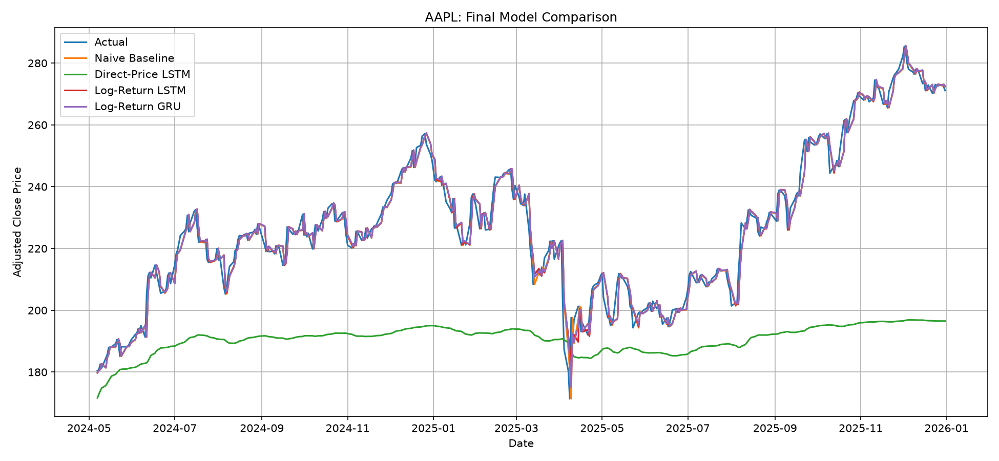

# Stock Price Prediction with PyTorch

## Project Overview

This project compares LSTM and GRU neural networks for one-day-ahead AAPL stock-price prediction using PyTorch. It begins with direct price-level prediction and then investigates log-return modeling after the first approach fails to generalize to unseen price regimes.

The comparison includes:

1. Naive persistence baseline
2. Direct-Price LSTM
3. Log-Return LSTM
4. Log-Return GRU

## Problem Definition

The objective is to explore a complete machine-learning workflow for financial time-series forecasting:

- historical stock-data preparation,
- chronological train/validation/test splitting,
- sequence generation,
- recurrent neural-network modeling,
- model evaluation,
- baseline comparison,
- and critical analysis of forecasting limitations.

The original experiment used:

```text
previous 20 prices → next price
```

After observing poor generalization to higher price levels, the prediction task was changed to:

```text
previous 20 log returns → next log return
```

The predicted log return is converted back into a price using:

```text
predicted_price = previous_price × exp(predicted_log_return)
```

## Repository Structure

```text
pytorch-stock-prediction/
├── data/
├── models/
├── notebooks/
│   ├── 01_environment_test.ipynb
│   ├── 02_ml_fundamentals.ipynb
│   ├── 03_pandas_practice.ipynb
│   ├── 04_regression_mini_project.ipynb
│   ├── 05_pytorch_fundamentals.ipynb
│   ├── 06_time_series_fundamentals.ipynb
│   ├── 07_stock_data_preparation.ipynb
│   ├── 08_lstm_model.ipynb
│   ├── 09_lstm_log_return.ipynb
│   ├── 10_gru_log_return.ipynb
│   └── 11_model_evaluation.ipynb
├── results/
├── src/
│   ├── __init__.py
│   ├── data.py
│   ├── evaluation.py
│   ├── models.py
│   └── training.py
├── README.md
├── req.txt
└── check_setup.py
```

## Dataset

Historical AAPL market data was downloaded from Yahoo Finance. The project uses adjusted closing prices to account for corporate actions such as stock splits and dividends.

The dataset is divided chronologically:

- 70% training
- 15% validation
- 15% testing

Random splitting is intentionally avoided because future observations must not be used to predict past observations in a time series.

## Data Preparation

The preparation pipeline:

1. Cleans and orders the adjusted closing prices by date.
2. Calculates daily log returns as `log(price_t / price_t-1)`.
3. Fits preprocessing scalers using only the training period.
4. Builds rolling sequences with a 20-day lookback window.
5. Preserves chronological train, validation, and test boundaries.

All preprocessing parameters are learned exclusively from the training period and then applied to validation and test data. This prevents future information from leaking into model training.

## Experiments

### Experiment 1: Direct-Price LSTM

The first LSTM receives the previous 20 adjusted prices and predicts the next absolute price. It performs reasonably during training and validation but fails to extrapolate to the higher price regime in the test period.

### Experiment 2: Log-Return LSTM

The same LSTM architecture is trained to predict the next daily log return. Each predicted return is reconstructed into a next-day price using the most recently observed price.

### Experiment 3: Log-Return GRU

The GRU uses the same return sequences, chronological split, lookback window, batch size, and main hyperparameters as the Log-Return LSTM. This keeps the architecture comparison as fair as possible.

### Final Evaluation

All four approaches are recalculated over the 415 dates shared by every experiment, covering May 7, 2024 through December 31, 2025.

## Model Architecture

Both recurrent models use:

- input size: 1
- hidden size: 32
- recurrent layers: 2
- dropout: 0.2
- output size: 1

The final hidden representation of each 20-day sequence is passed through a linear layer to produce one prediction.

| Model | Trainable parameters |
|---|---:|
| LSTM | 12,961 |
| GRU | 9,729 |

## Training

Both recurrent models use:

- Mean Squared Error loss
- Adam optimizer
- learning rate: 0.001
- maximum epochs: 100
- early-stopping patience: 15
- batch size: 32

The best model state is selected according to validation loss and restored after training. The shared implementation is available in `src/training.py`.

## Evaluation Metrics

Models are evaluated using:

- Mean Absolute Error (MAE)
- Mean Squared Error (MSE)
- Root Mean Squared Error (RMSE)
- RMSE improvement over the baseline
- Direction accuracy
- Training time
- Trainable parameter count

The main reference is a naive persistence baseline:

```text
next_price = current_price
```

## Results

| Model | MAE | RMSE | RMSE vs Baseline | Direction Accuracy | Training Time |
|---|---:|---:|---:|---:|---:|
| Naive Baseline | 2.5887 | 3.8382 | 0.00% | N/A | N/A |
| Direct-Price LSTM | 36.3403 | 41.3947 | -978.48% | 42.41% | 7.09 s |
| Log-Return LSTM | **2.5820** | **3.8251** | **+0.34%** | **53.98%** | 9.16 s |
| Log-Return GRU | 2.5919 | 3.8434 | -0.13% | 52.77% | 30.82 s |



## Key Findings

### 1. Direct price prediction generalized poorly

The Direct-Price LSTM achieved relatively low training and validation errors but performed poorly during the test period.

The training price range was approximately `$20.55–$177.79`, while the test period reached approximately `$171.37–$285.41`. Model predictions remained mostly below approximately `$197`, indicating poor generalization to the higher price regime.

### 2. Log-return modeling dramatically improved the LSTM

Changing the prediction target from absolute prices to log returns reduced LSTM test RMSE from `41.3947` to `3.8251`, an improvement of approximately **90.76%**.

The architecture remained largely unchanged, demonstrating that the representation of the forecasting problem had a major effect on performance.

### 3. Log-Return LSTM achieved the best neural-network result

The Log-Return LSTM achieved:

- MAE: 2.5820
- RMSE: 3.8251
- Direction accuracy: 53.98%

It slightly outperformed the Log-Return GRU.

### 4. The naive baseline remained extremely competitive

The Naive Baseline achieved an RMSE of 3.8382. The best LSTM improved this by only approximately 0.34%.

The results therefore do not provide strong evidence that the recurrent networks offer a practically meaningful advantage over a simple one-day persistence forecast. This highlights why machine-learning models should always be compared with simple baselines.

### LSTM vs GRU

The GRU contains fewer trainable parameters than the LSTM but did not outperform it in this experiment. Training-time results should be interpreted cautiously because early stopping, hardware, and backend behavior can affect runtime.

## Limitations

- Only AAPL is evaluated.
- Only historical adjusted closing prices are used as primary market information.
- Transaction costs are not considered.
- The project does not implement a trading strategy.
- Only one historical train/validation/test split is used.
- Market regimes can change substantially over time.
- Daily stock returns contain a large amount of noise.
- A small RMSE improvement does not necessarily imply profitable trading performance.

Future evaluation should include walk-forward testing and additional market periods.

## Installation

Create and activate a virtual environment:

```bash
python3 -m venv .venv
source .venv/bin/activate
```

Install dependencies:

```bash
pip install -r req.txt
```

Verify the environment:

```bash
python check_setup.py
```

## Usage

The notebooks are designed to be followed in numerical order.

Start Jupyter Lab:

```bash
jupyter lab
```

Begin with `notebooks/01_environment_test.ipynb` and continue through `notebooks/11_model_evaluation.ipynb`.

Reusable modules can be imported directly from `src`:

```python
from src.data import calculate_log_returns, create_sequences
from src.evaluation import direction_accuracy, regression_metrics
from src.models import GRUModel, LSTMModel
from src.training import train_model
```

## Future Work

- Walk-forward validation
- Additional stocks and market periods
- Market-index features
- Trading volume and volatility features
- Technical indicators
- Macroeconomic data
- Hyperparameter optimization
- Transformer-based time-series models
- Strategy-level financial metrics

## Current Status

- [x] Project environment created
- [x] PyTorch installed
- [x] Jupyter environment configured
- [x] Machine learning fundamentals
- [x] Pandas exercises
- [x] Regression mini-project
- [x] PyTorch fundamentals
- [x] Time-series fundamentals
- [x] Stock dataset preparation
- [x] LSTM implementation
- [x] GRU implementation
- [x] Model evaluation
- [x] Final documentation

## Disclaimer

This project is intended solely for educational and research purposes. It does not constitute financial or investment advice, and the models should not be used as the sole basis for real-world trading decisions.
